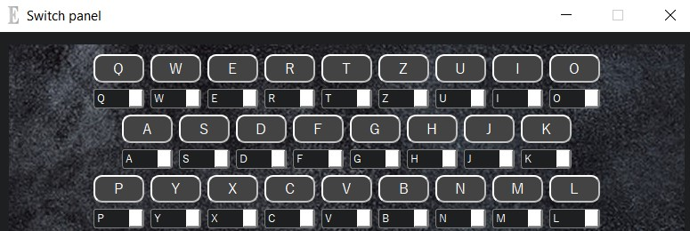

# Enigma machine
***

Appearance
=====================

**Screenshot 1 - Main Window**
 
 

**Screenshot 2 - Rotate positions**
 
 

**Screenshot 3 - Switch panel**
 
 

Procedure Encode:
=====================
1. Choise your configuration.
    1. **Rotate positions** *(default 2.21.16)*.
    2. Choise switch letters on **Switch panel** *(Setting -> Switch panel or  CTRL + S)*.
    3. Remember configuration.
		
2. Enter text (**NOTICE: Encode letter only with UPPER case!**).
    1. Using the round buttons with letters.
    2. Using your keyboard in English transcription.
    3. Open **.txt** file with text *(File -> Open or CTRL + O)*.
    4. Drop **.txt** file to the app.
	5. Paste using button *Paste* on main Window and on *File/Paste*.
	6. Paste using *Ctrl+V*.
	
3. Save text *(File -> Save or CTRL + S)* or Copy *(button on main Window )*.

Procedure Decode:
=====================
1. Set configurations for decode *(it are start configuration* **Rotate positions** *and* **Switch panel**
	*during encode)*.
	
2. Enter text (see above "Procedure Encode/Enter text").
	
	
Additional features:
=====================
1. Button **Paste** on main window -> encode the text in clipboard memory.
2. Button **Copy** on main window -> copy current text to clipboard memory.
3. Button **Clear** on main window -> clear text frame.
4. Button **Reload** on main window -> set default configurations.
	

		